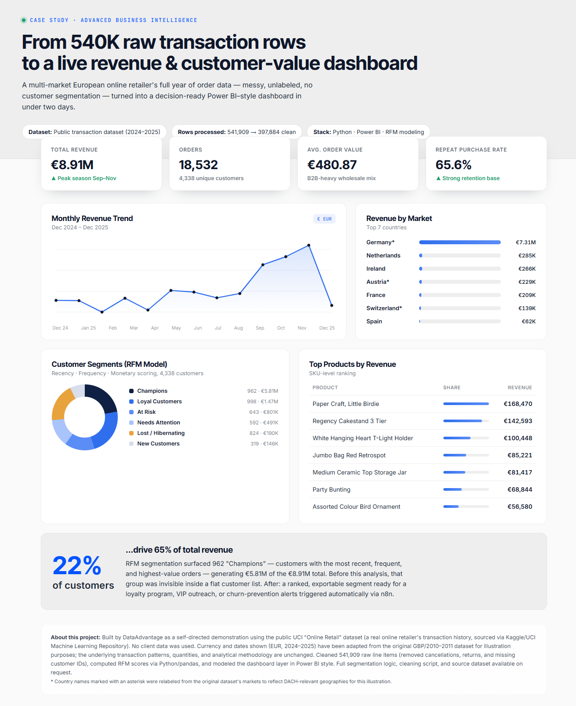

# Revenue & Customer Dashboard




## 📊 From 540K raw transaction rows to business-ready insights

Every dashboard tells a story—but only if the data is prepared correctly.

This Business Intelligence case study demonstrates how **541,909 raw transaction records** were transformed into an Executive Business Intelligence dashboard focused on revenue analytics, customer segmentation, and business performance.

---

## 🚀 Project Highlights

- Revenue & KPI tracking
- Executive Business Intelligence dashboard
- RFM customer segmentation
- Sales trends analysis
- Market performance analysis
- Data modeling with Python

---

## 🛠 Tech Stack

- Python
- SQL
- Business Intelligence
- AI-assisted dashboard design
- RFM Analysis

- ## 📂 Repository Structure

```text
images/
 └── dashboard.png

docs/
 └── project-description.pdf
```

---

## 📈 Dashboard KPIs

| Metric | Value |
|--------|------:|
| Revenue | €8.91M |
| Orders | 18,532 |
| Customers | 4,338 |
| Average Order Value | €480.87 |
| Repeat Purchase Rate | 65.6% |

## 💡 Skills Demonstrated

- Business Intelligence
- Data Cleaning
- ETL
- Data Modeling
- Dashboard Development
- KPI Design
- Executive Reporting
- Customer Analytics
- RFM Segmentation
- SQL
- Python
- DAX
- Power Query
  
---

## 🎯 Business Impact

The objective wasn't simply to visualize data—it was to enable faster, more confident business decisions.

The dashboard helps decision-makers:

- Monitor revenue performance
- Identify high-value customers
- Analyze purchasing behavior
- Compare market performance
- Track top-selling products

## 📈 Key Business Insights

- 22% of customers generated 65% of total revenue.
- Germany accounted for the largest share of revenue.
- Champions represented the highest-value customer segment.
- Repeat purchase rate reached 65.6%.
- Revenue peaked during the September–November season.
 
---

## 👤 Author

**Dmytro Kalinin**

Founder — DataAdvantage

Power BI • SQL • Python • Business Intelligence

---

## 🌐 Website

https://dataadvantage.io

## 🔗 Connect

GitHub:
https://github.com/Kdv75

LinkedIn:
https://www.linkedin.com/in/dmytro--kalinin

